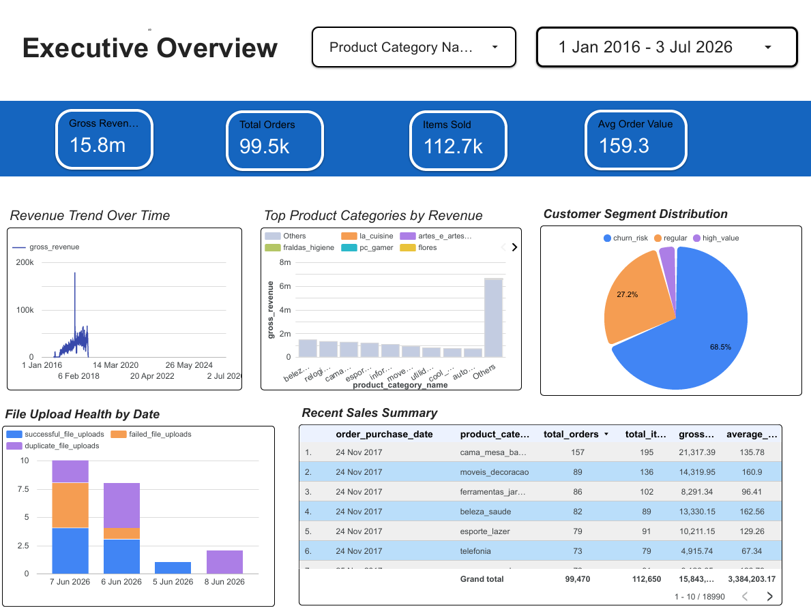
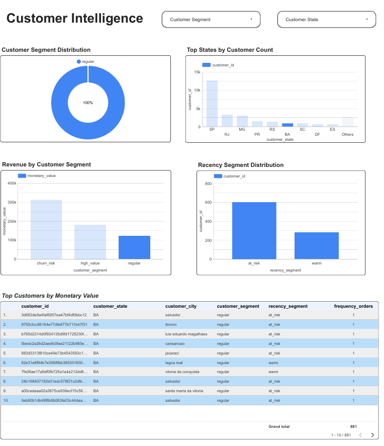
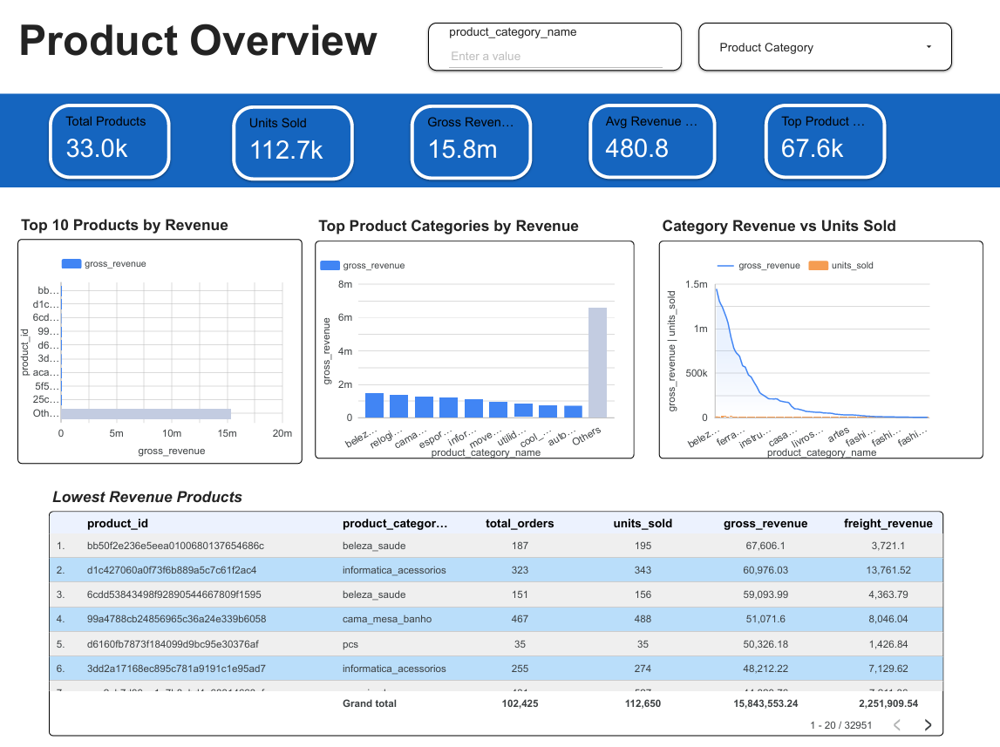
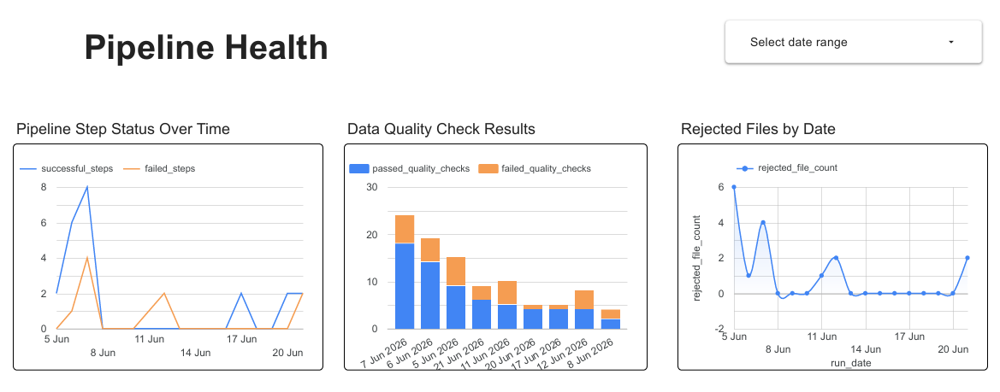

# 🚀 E-Commerce Intelligence Platform on Google Cloud Platform

<p align="center">


</p>

---

# 📌 Overview

The **E-Commerce Intelligence Platform** is an end-to-end batch data engineering project built on **Google Cloud Platform (GCP)**.

It demonstrates how modern organizations ingest raw business data, validate data quality, build scalable data warehouse layers, orchestrate transformations, monitor pipelines, and deliver analytics-ready datasets for business intelligence.

The project follows the **Medallion Architecture (Bronze → Silver → Gold)** and implements production-oriented engineering practices including audit logging, metadata management, data quality testing, orchestration, monitoring, and automated workflows.

---

# 🎯 Business Problem

E-commerce organizations receive data from multiple operational systems every day.

Without a structured pipeline:

- inconsistent data enters analytics
- duplicate records reduce trust
- failed uploads are difficult to trace
- business reports become unreliable
- pipeline failures go unnoticed

This platform solves those problems by creating a scalable and automated cloud-native data engineering pipeline.

---

# 🏗 High-Level Architecture


---

# ⚙ Technology Stack

## Cloud

- Google Cloud Platform
- Cloud Storage
- Cloud Run
- BigQuery
- Cloud Logging
- Cloud Monitoring

## Data Engineering

- Python
- SQL
- dbt
- Apache Airflow
- Docker

## Visualization

- Looker Studio

## Development

- Git
- GitHub
- VS Code

---

# 📂 Project Structure

```text
ecommerce-intelligence-platform

│
├── ingestion/
│     ├── app/
│     ├── Dockerfile
│     └── requirements.txt
│
├── ecom_pipeline/
│     ├── models/
│     │      ├── bronze/
│     │      ├── silver/
│     │      └── gold/
│     ├── tests/
│     ├── macros/
│     └── dbt_project.yml
│
├── airflow/
│     ├── dags/
│     ├── plugins/
│     └── docker-compose.yml
│
├── dashboard/
│
├── docs/
│
└── README.md
```

---

# 🔄 End-to-End Data Pipeline

# 📊 Dashboards

The project includes interactive dashboards built with Looker Studio. Screenshots exported from the `dashboard/` folder are shown below and placed under their matching sections.

### Executive Overview



- Revenue KPIs
- Orders
- Customers
- Pipeline Health

### Sales Performance


- Revenue Trends
- Monthly Sales
- Order Status

### Customer Intelligence



- Customer Distribution
- Geographic Analysis
- RFM Analysis

### Product Performance



- Top Products
- Seller Performance
- Product Categories

### Pipeline Health



- Upload Status
- Failed Records
- Data Quality Checks
- Pipeline Runs


# 📈 Monitoring

Pipeline monitoring includes:

- Cloud Logging
- Cloud Monitoring
- Error Tracking
- Pipeline Metrics
- Log Explorer
- Alert Policies

---

# 🐳 Docker

Docker is used for

- dbt environment
- Apache Airflow environment
- Local development consistency

---

# 📌 Production Features

✔ Modular Architecture

✔ Medallion Data Model

✔ Cloud-native Storage

✔ Metadata Management

✔ Audit Logging

✔ Data Validation

✔ Automated Transformations

✔ Workflow Orchestration

✔ Monitoring

✔ Dashboard Reporting

✔ Containerized Development

---

# 🚀 Current Project Status

| Component | Status |
|------------|----------|
| Upload UI | ✅ |
| Cloud Run | ✅ |
| Validation | ✅ |
| GCS | ✅ |
| Bronze Layer | ✅ |
| Metadata | ✅ |
| Audit Logging | ✅ |
| dbt Silver | ✅ |
| dbt Gold | ✅ |
| Airflow | ✅ |
| Docker | ✅ |
| Dashboard | ✅ |
| Cloud Logging | ✅ |
| Cloud Monitoring | ✅ |
| AI Insights | 🚧 Planned |

---

# 📚 Skills Demonstrated

- Data Engineering
- ETL / ELT
- Data Warehousing
- Data Modeling
- Cloud Architecture
- SQL
- Python
- BigQuery
- Cloud Storage
- Cloud Run
- dbt
- Apache Airflow
- Docker
- Looker Studio
- Cloud Logging
- Cloud Monitoring
- Git
- GitHub

---

# 🚀 Future Roadmap

The next planned enhancements include:

- Gemini-powered Business Insights
- Natural Language to SQL
- Customer Segmentation
- Customer Churn Prediction
- Product Recommendation Engine
- Sales Forecasting
- Embedded Dashboard in Upload UI
- AI Assistant Interface

---

# 👨‍💻 Author

**Muhammad Saad**

Data Engineer | Google Cloud | BigQuery | dbt | Airflow | Python | SQL 

- GitHub: https://github.com/Muhammad-Saad12345
- LinkedIn: *https://www.linkedin.com/in/saad-yaqoob-05244726b/*

---

## ⭐ If you found this project useful, please consider giving it a star.
